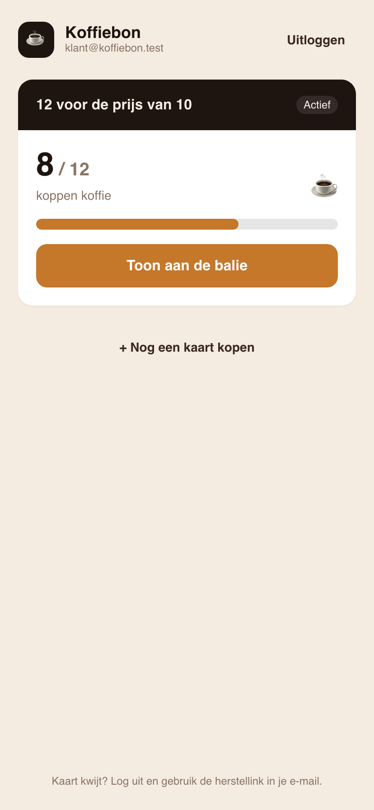
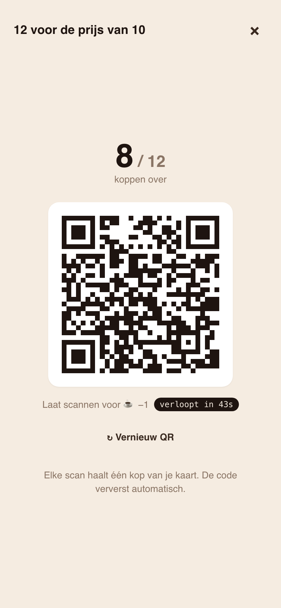
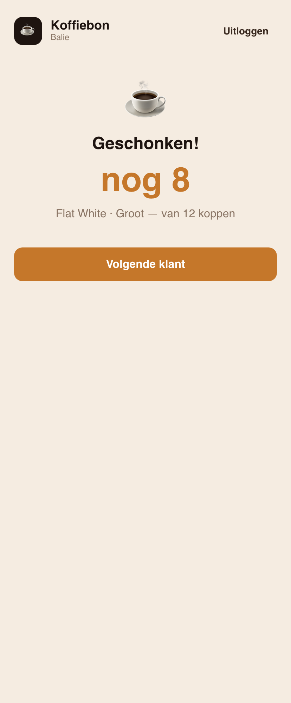
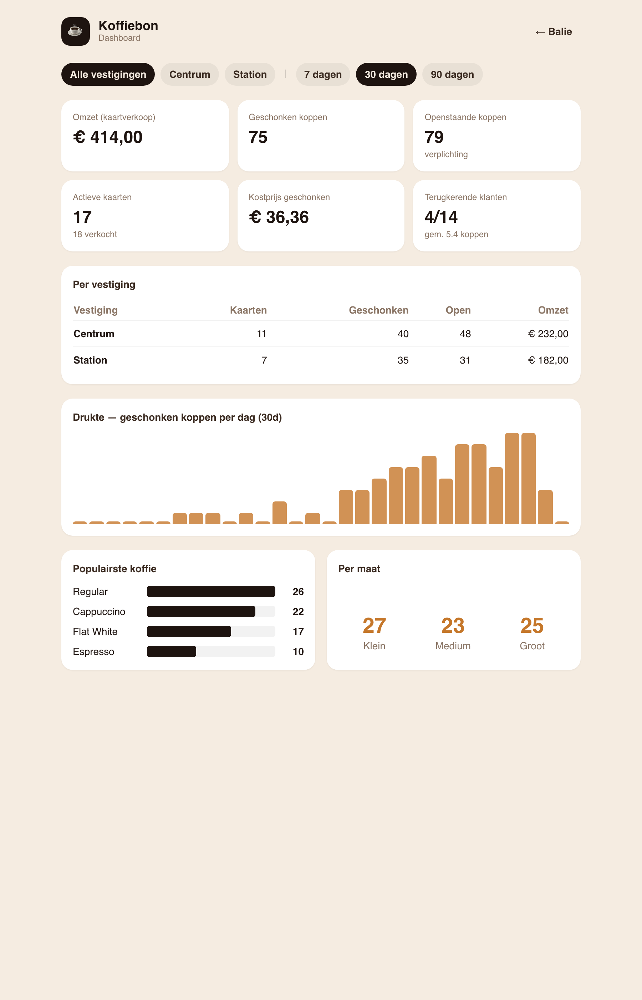

# Koffiebon

Prepaid koffiekaart — vooruit betaald in **koppen koffie**, verzilverd aan de balie via een
**roterende, eenmalige QR-code**. De server is de bron van waarheid voor het saldo; de QR is "dom".

- **Backend:** Laravel 13 (API-only), Sanctum, Pest. Geld in hele centen, tijdzone `Europe/Amsterdam`.
- **Frontend:** React 18 + TypeScript + Vite PWA in [`/frontend`](frontend) — klant-PWA (`/`) en
  balie-app (`/balie`), één codebase, Tailwind met het koffie-palet, TanStack Query, `qrcode.react`,
  `@zxing/browser` + hardware-scanner.
- Zie [`CLAUDE.md`](CLAUDE.md) voor de volledige opdracht/spec, [`API.md`](API.md) voor de endpoints,
  en [`DECISIONS.md`](DECISIONS.md) / [`PROGRESS.md`](PROGRESS.md) voor keuzes en voortgang.

## Screenshots

| Klant — kaart + saldo | Klant — roterende QR | Balie — na een scan |
|---|---|---|
|  |  |  |

**Merchant-dashboard** (fase 3) — echte cijfers uit het grootboek, per vestiging en drankje:



Meer in [`docs/screenshots/`](docs/screenshots) (registratie, balie-scanscherm met drank-keuze,
nieuwe-kaart-flow).

## Lokale setup (Docker / Laravel Sail)

> **Alle php/artisan/composer/npm-commando's draaien in de container.** De service heet `laravel.bon`;
> `APP_SERVICE=laravel.bon` staat in `.env` zodat de `sail`-wrapper werkt.

```bash
# 1. Env klaarzetten (eenmalig)
cp .env.example .env

# 2. Containers bouwen + starten (native arm64 op Apple Silicon)
DOCKER_DEFAULT_PLATFORM=linux/arm64 docker compose up -d --build

# 3. Dependencies, app key, database
./vendor/bin/sail composer install
./vendor/bin/sail artisan key:generate
./vendor/bin/sail artisan migrate:fresh --seed
```

De app draait nu op **http://localhost** (API), Mailpit op **http://localhost:8025**.

Lokaal dev draait op **SQLite** (`database/database.sqlite`). PostgreSQL zit achter een compose-profile
en hoeft niet te starten: `./vendor/bin/sail --profile pgsql up -d` indien gewenst.

### E-mail (verificatie / magic-link)

E-mail gaat via de **queue** (database driver). Start een worker om verificatie-/herstelmails te
versturen; ze landen in **Mailpit**:

```bash
./vendor/bin/sail artisan queue:work
```

### Frontend (Vite PWA)

De React-app staat in `frontend/` en draait **in de container** (Node 20). De dev-server proxyt
`/api` naar de Laravel-app, dus alles is same-origin met bearer-tokens.

```bash
docker exec -w /var/www/html/frontend koffiebon-laravel.bon-1 npm install
docker exec -d -w /var/www/html/frontend koffiebon-laravel.bon-1 npm run dev
# Productiebuild: npm run build  (genereert dist/ + service worker + manifest)
```

De PWA draait op **http://localhost:5173** (klant op `/`, balie op `/balie`). Zet
`FRONTEND_URL=http://localhost:5173` in `.env` zodat de e-mailverificatie en de QR-deeplink
daarheen wijzen.

## Tests

```bash
# Volledige suite (draait op SQLite :memory:)
docker exec -w /var/www/html koffiebon-laravel.bon-1 php artisan test
# of:
./vendor/bin/sail pest
```

Belangrijke tests: `PricingServiceTest` (korting onafhankelijk van prijs), `RedemptionServiceTest`
(parallelle verzilvering — nooit < 0 of > totaal), `ScanFlowTest` (volledige flow A→C + single-use/
verlopen tokens, geverifieerd e-mailadres verplicht, herstel op ander toestel).

## Demo-data (na `migrate:fresh --seed`)

| Rol   | E-mail                  | Wachtwoord |
|-------|-------------------------|------------|
| Admin | `admin@koffiebon.test`  | `password` |
| Balie | `balie@koffiebon.test`  | `password` |
| Klant | `klant@koffiebon.test`  | passwordless (device-token via e-mail) |

De demo-klant heeft één actieve kaart **"12 voor de prijs van 10"** met saldo **9/12**.

## De flow in het kort

1. **Klant registreert** → e-mail verifiëren → PWA krijgt een device-token.
2. **Kaart kopen** → klant toont identify-QR → balie scant → kiest product → legt betaling vast →
   `issue + activate + payment` in één transactie → kaart actief.
3. **Koffie verzilveren** → klant toont roterende redeem-QR → balie scant → `−1 kop` (atomisch).
4. **Herstel** → magic-link op een ander toestel → zelfde kaarten/saldi vanaf de server.
